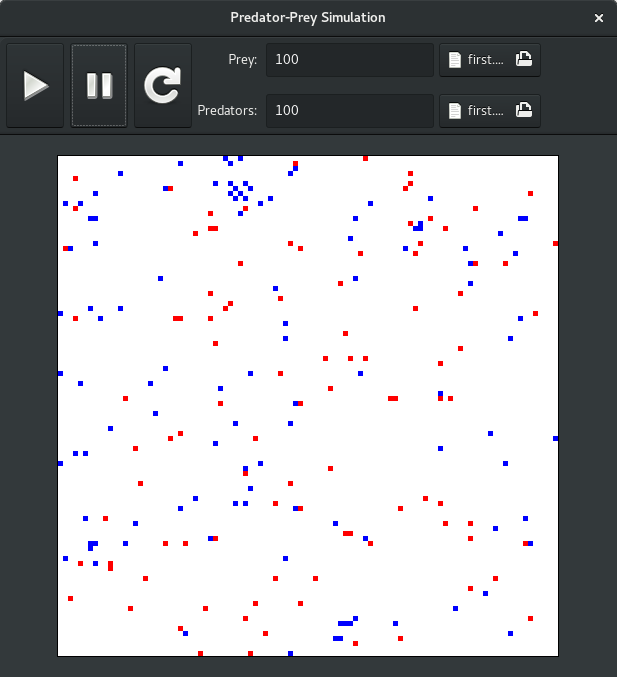

# Predator-Prey Simulation

This app simulates the predator-prey dynamics. The behaviour of the animals
is coded into a basic script called sim^2. The app provides a graphical 
overview of the simulation as it unfolds.

This application explores; the GTK+ library for developing desktop apps on
Linux, and basic compiler design.

Usage:
* First specify the initial number of predators and prey.
* Select the sim^2 scripts that govern the behaviour of the animals.
* Click the reset button to initialize the simulation.
* Click the play button to execute it.

The details of the simulation are provide in the file `doc/TaskB.pdf`. 
A sim^2 script is provided in `doc/first.txt`. 

## Installation

* Install the gtk3-devel package through your distribution.
* Build app with `make`.
* Run app with `bin/sim2-gtk`.
